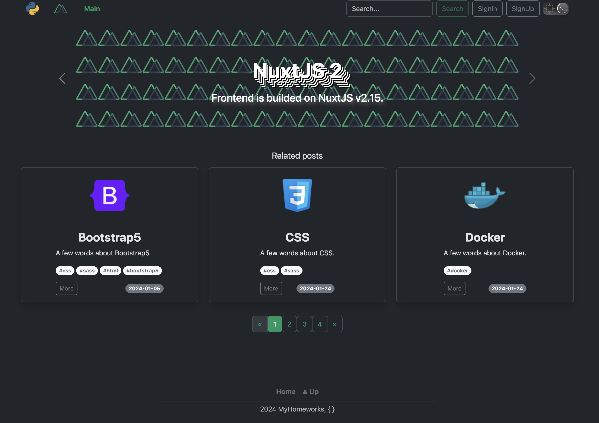
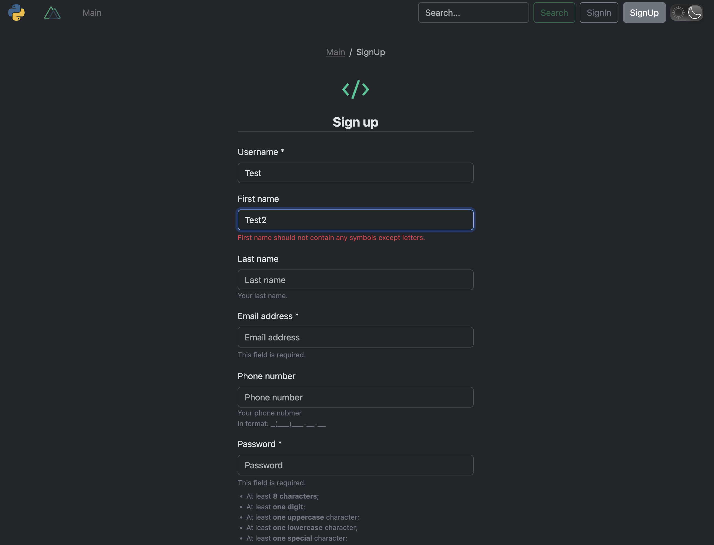
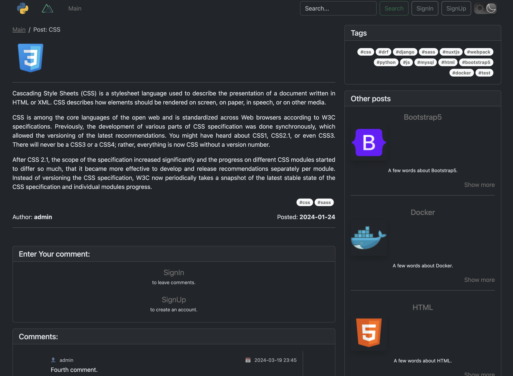
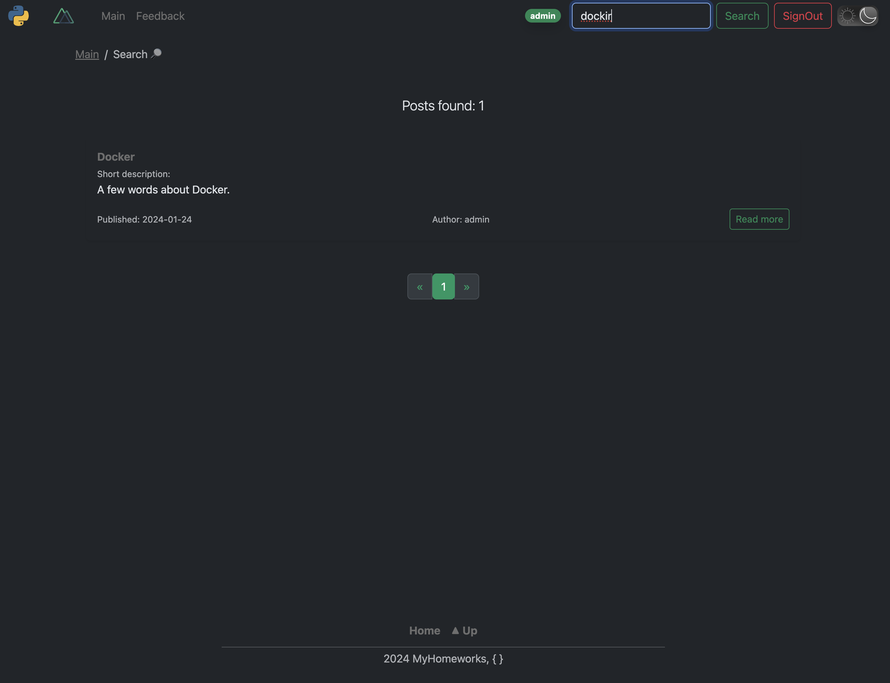
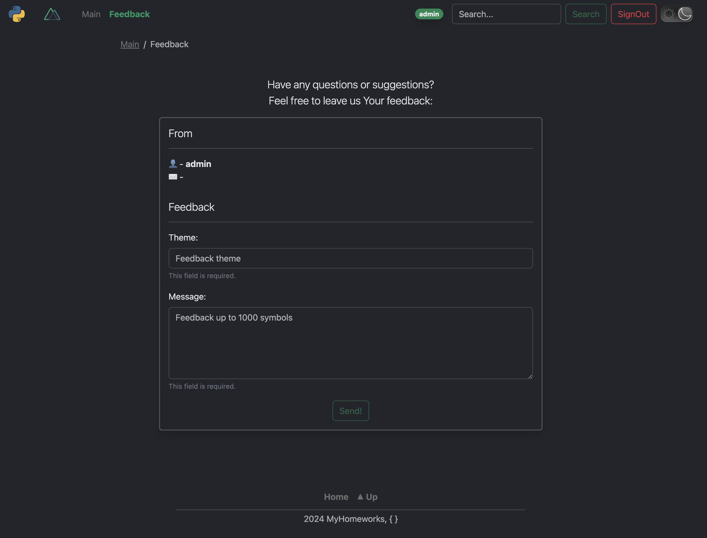
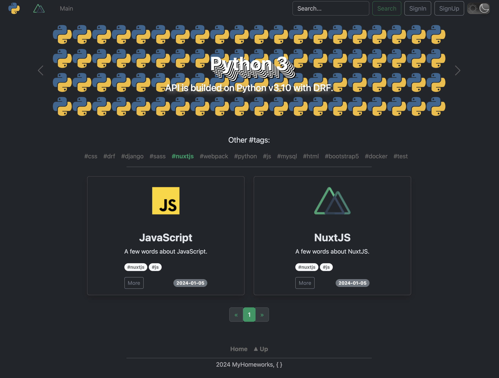
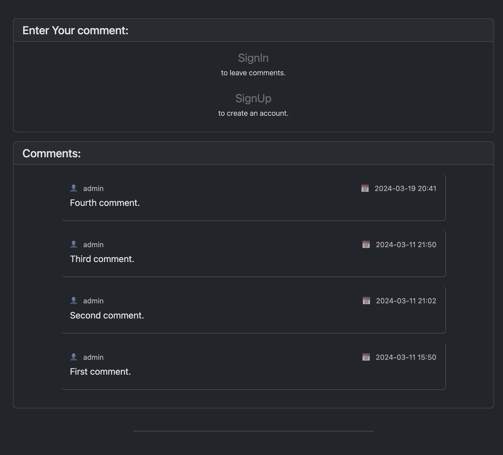
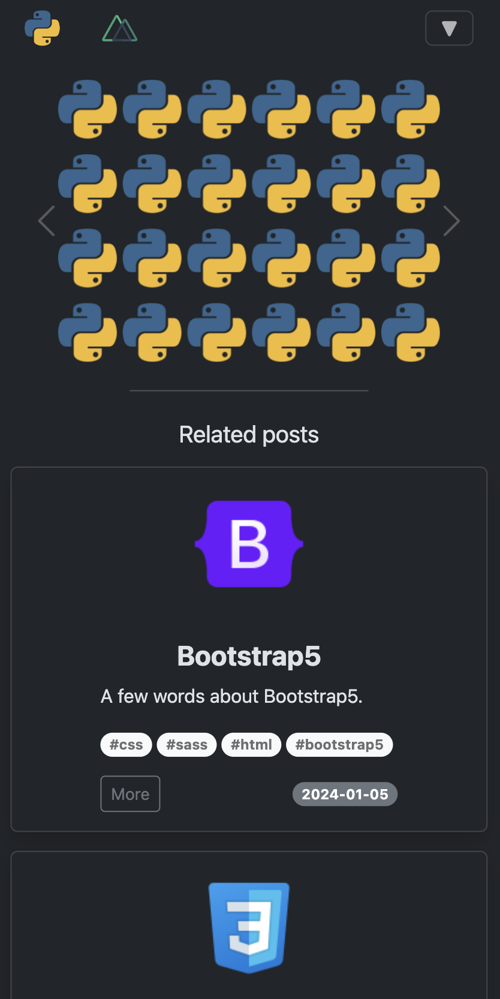
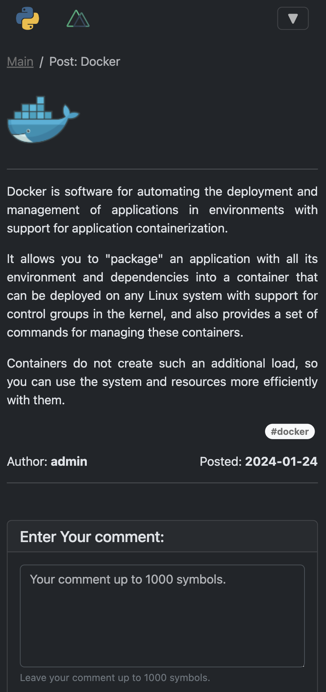

## Description

This is a test project 'IT_Blog' using:

- MySQL;
- Django Rest Framework;
- Gunicorn;
- NuxtJS (Nuxt2);
- Bootstrap5;
- Webpack;
- Docker + Compose;
- NGINX;
- JWT (libraries for the API);
- CSS/SCSS/HTML.

```
!!! Production SSR setup with NGINX and Docker is not working properly !!!
```

## Launch instructions

1. Clone repository/archive to your **local folder**;
2. Open Terminal and make sure You are in **local folder**:

    ```
    cd '.../local_folder'
    ```

3. Copy file dev.env and rename to .env in the same root directory:

    ```
    cp dev.env .env
    ```

4. Open and follow the instructions properly in the new created .env file;

5. For this step you should already have installed Docker and Compose on your PC. Start installation:

    ```
    docker-compose up --build
    ```

- Installation can take some time, it depends on your PC resources;
- After the installation is completed, the client-server will start automatically on localhost:8080;
- Open app using <http://localhost:8080/> in your browser;

6. The superuser (admin) has been already created;

- You can login under current superuser (admin) using <http://localhost:8080/admin> with standart credentials:

    ```
    login: admin

    pass: admin
    ```

- For password change open **another Terminal** and enter:

   ```
    docker exec -it api sh

    python3 manage.py changepassword admin
   ```

- Create new password, confirm and then exit:

    ```
    exit
    ```

  *(close Terminal after successful password replacement)*

7. To **stop** the app (**server**):

    ```
    Ctrl + C
    ```

8. To **stop** the app (**stop** all docker **containers**):

   ```
   docker compose stop
   ```

9. To **start** the app (**start** all docker **containers**):

   ```
   docker compose start
   ```

10. To completely **remove** all created docker **containers, images and volumes**:

   ```
   docker compose down --volumes --rmi all
   ```

- Note, that:
  - Add/edit/delete posts: only via admin-panel (Users can not to do that);
  - Add comments: only for registered and authenticated Users.
  
**p.s.:**

---> ./django_logs/ : contains **django rest framework** error logs.

---> ./gunicorn_logs/ : contains **gunicorn** access and error logs.

## Screenshots

1. *Main page*


  
2. *SignIn form*


3. *SignUp form*



4. *Detailed info about post*



5. *Search block*



6. *Feedback block*


7. *Navigation by tags*


7. *Comments' block (auth and not auth)*



8. *SignOut page*


10. *Mobile look like*

<div align="center">
  
  
  
  
</div>
